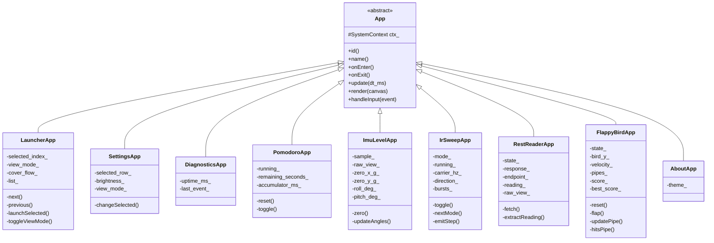
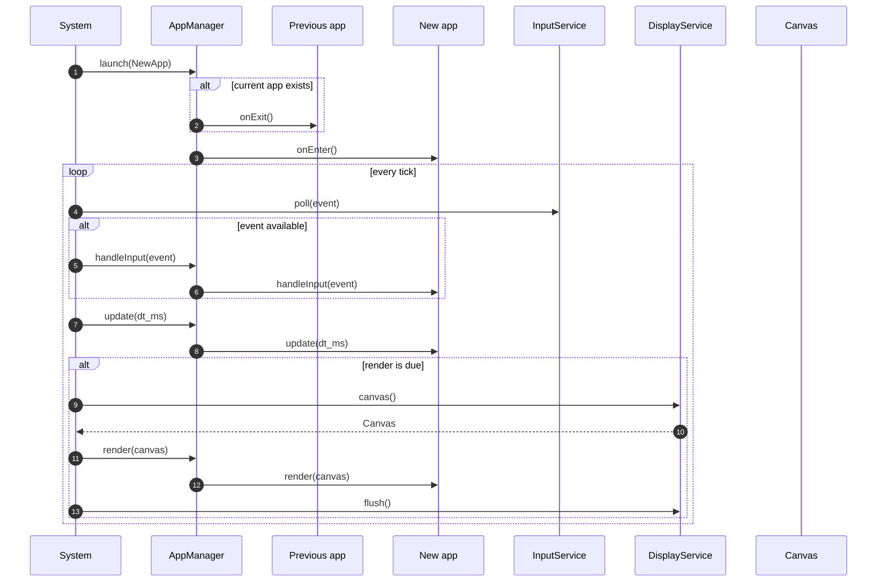
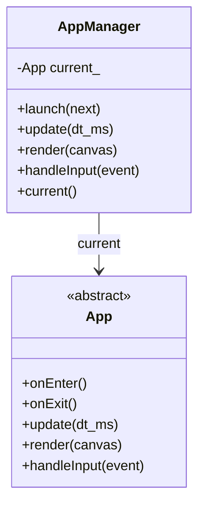
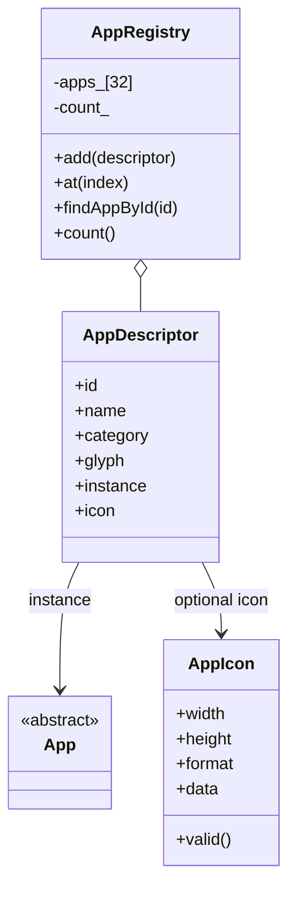
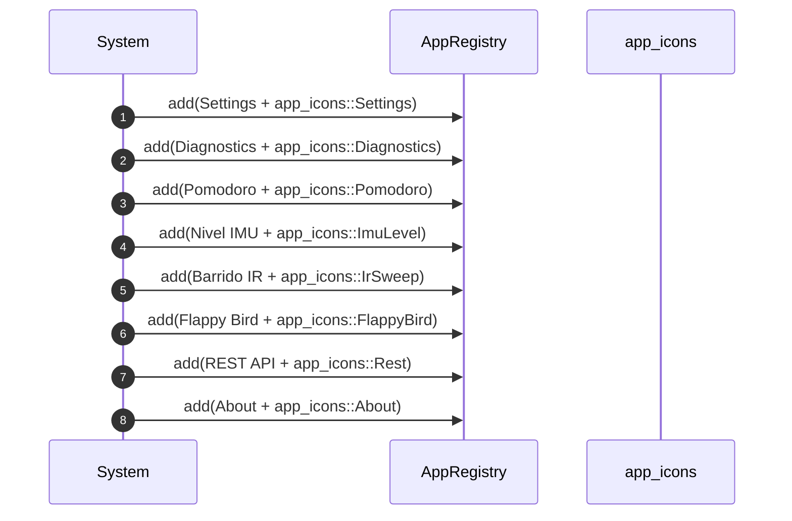
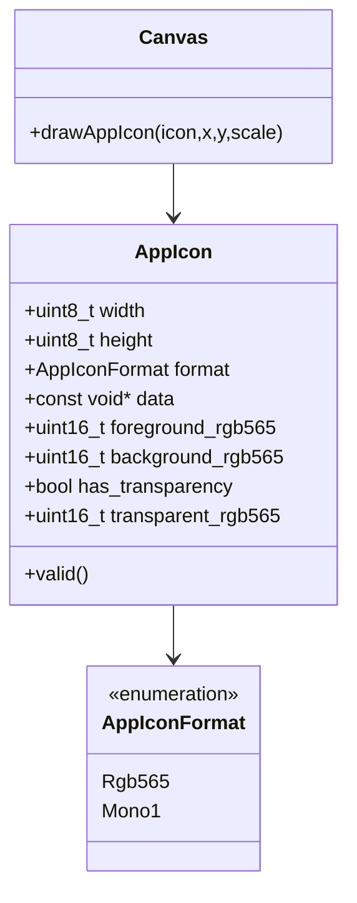
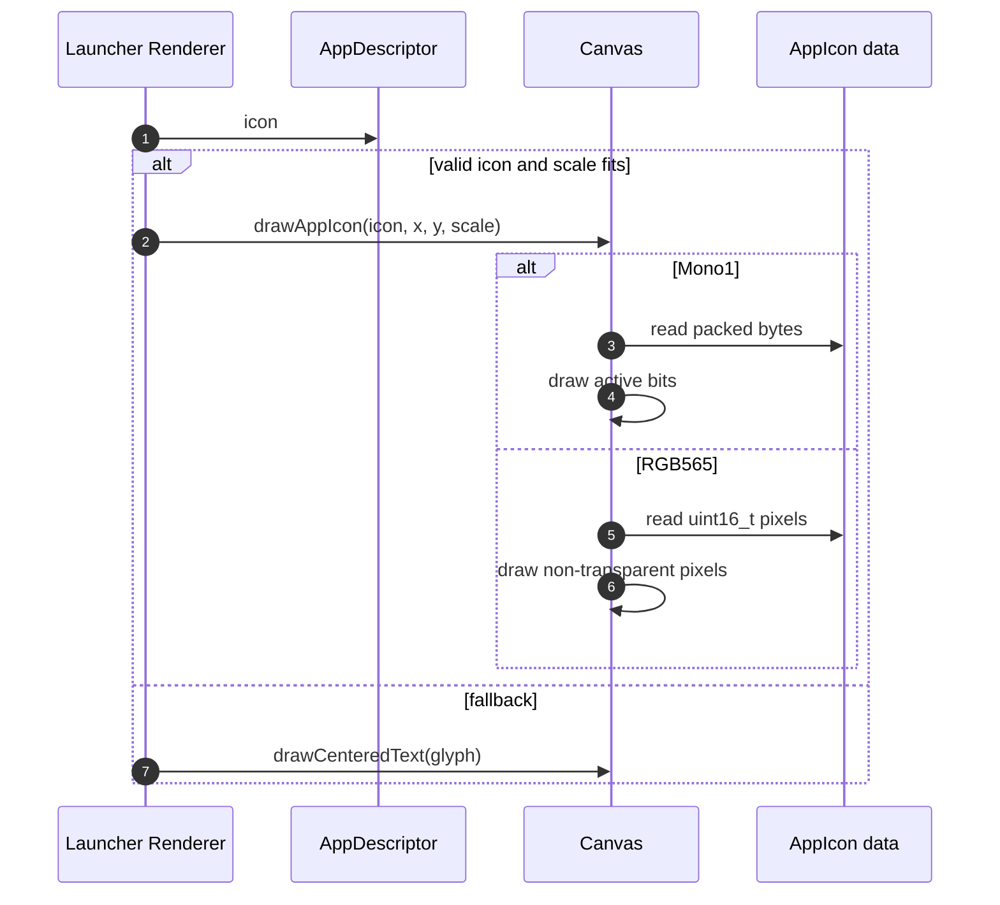
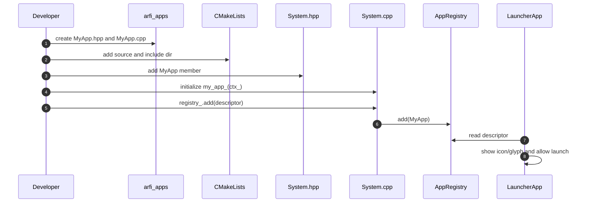
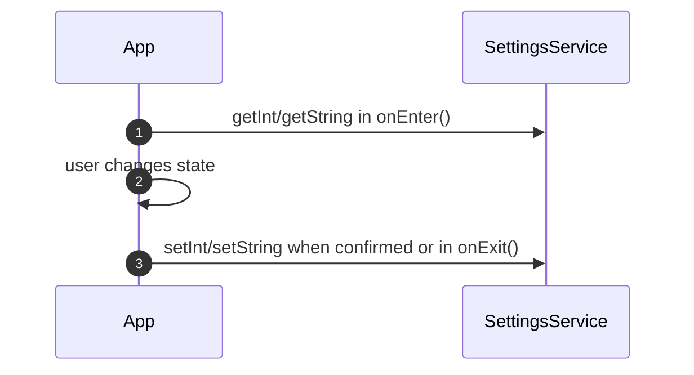

# arfiOS App Model

arfiOS v0.1 apps are native C++ classes compiled into the firmware. They are not external binaries and they are not runtime-loaded scripts. This keeps memory, safety, and lifecycle rules simple on ESP32.

Each app:

- inherits from `arfi::App`;
- receives a `SystemContext&` in its constructor;
- implements `update`, `render`, and `handleInput`;
- is exposed to the launcher through an `AppDescriptor`;
- may provide a flash/PROGMEM bitmap icon, with a text `glyph` fallback.

## Base Interface

```cpp
class App {
public:
    explicit App(SystemContext& ctx) : ctx_(ctx) {}
    virtual ~App() = default;

    virtual const char* id() const = 0;
    virtual const char* name() const = 0;

    virtual void onEnter() {}
    virtual void onExit() {}

    virtual void update(uint32_t dt_ms) = 0;
    virtual void render(Canvas& canvas) = 0;
    virtual bool handleInput(const InputEvent& event) = 0;

protected:
    SystemContext& ctx_;
};
```

## App Class Diagram



## Lifecycle



## AppManager

`AppManager` keeps a single `current_` pointer.



Rules:

- `launch(nullptr)` does nothing.
- `launch(current_)` does not restart the app.
- On app switches, the manager calls `onExit()` on the previous app and then `onEnter()` on the new app.
- `update`, `render`, and `handleInput` are delegated only to the current app.

## AppRegistry And Descriptors

The launcher does not know concrete app classes. It reads descriptors from `AppRegistry`.

```cpp
struct AppDescriptor {
    const char* id = "";
    const char* name = "";
    const char* category = "";
    const char* glyph = "";
    App* instance = nullptr;
    const AppIcon* icon = nullptr;
};
```



`AppRegistry::add()` rejects:

- entries past `kMaxApps`;
- descriptors without `instance`;
- descriptors without `id`.

## Current App Registration

Registration happens in `System::registerApps()` after services are initialized.



Current table:

| ID | Name | Category | Icon | App |
|---|---|---|---|---|
| `settings` | Settings | System | Mono1 | `SettingsApp` |
| `diagnostics` | Diagnostics | System | Mono1 | `DiagnosticsApp` |
| `pomodoro` | Pomodoro | Tools | Mono1 | `PomodoroApp` |
| `imu_level` | Nivel IMU | Tools | Mono1 | `ImuLevelApp` |
| `ir_sweep` | Barrido IR | Tools | Mono1 | `IrSweepApp` |
| `flappy_bird` | Flappy Bird | Games | RGB565 | `FlappyBirdApp` |
| `rest_reader` | REST API | Tools | Mono1 | `RestReaderApp` |
| `about` | About | System | Mono1 | `AboutApp` |

## PROGMEM Icons

The `icon` field is optional. If it is `nullptr`, invalid, or too large for the available launcher slot, the renderer uses `glyph`.



Supported formats:

- `AppIconFormat::Mono1`: 1-bit packed bitmap, MSB-first. A `1` bit draws `foreground_rgb565`; a `0` bit draws `background_rgb565` when transparency is disabled.
- `AppIconFormat::Rgb565`: row-major `uint16_t` pixel array. A transparent color can be skipped.

Mono1 example:

```cpp
inline constexpr uint8_t kMyIconBits[] ARFI_PROGMEM = {
    0b00111100,
    0b01000010,
    0b10100101,
    0b10000001,
    0b10100101,
    0b10011001,
    0b01000010,
    0b00111100,
};

inline constexpr AppIcon MyIcon = {
    8,
    8,
    AppIconFormat::Mono1,
    kMyIconBits,
    0xFFFF,
    0x0000,
    true,
    0x0000,
};
```

RGB565 example:

```cpp
inline constexpr uint16_t kMyColorIcon[] ARFI_PROGMEM = {
    0xF81F, 0xFFFF, 0xFFFF, 0xF81F,
    0xFFFF, 0x07E0, 0x07E0, 0xFFFF,
    0xFFFF, 0x07E0, 0x07E0, 0xFFFF,
    0xF81F, 0xFFFF, 0xFFFF, 0xF81F,
};

inline constexpr AppIcon MyColorIcon = {
    4,
    4,
    AppIconFormat::Rgb565,
    kMyColorIcon,
    0xFFFF,
    0x0000,
    true,
    0xF81F,
};
```

Render sequence:



## App Controls

| App | `Primary Short` | `Secondary Short` | `Secondary Long` | `Primary Long` |
|---|---|---|---|---|
| Launcher | open selected app | next app | previous app | toggle Cover/List |
| Settings | change selected row value | next row | previous row | return to launcher when not in launcher |
| Diagnostics | record A short | record B short | record B long | return to launcher |
| Pomodoro | start/pause | reset | reset/alternate behavior | return to launcher |
| Nivel IMU | set zero | toggle raw/level view | clear zero | return to launcher |
| Barrido IR | run/stop | change mode | reset carrier | return to launcher |
| REST API | GET | raw/body view | no action | return to launcher |
| Flappy Bird | flap/start/retry | no action | no action | return to launcher |
| About | no action | no action | no action | return to launcher |

`Primary Long` is intercepted by `System` when the current app is not `LauncherApp`, so most apps do not implement their own exit handling.

## Adding A Native App

1. Create `components/arfi_apps/include/arfi/apps/MyApp.hpp`.
2. Create `components/arfi_apps/my_app/MyApp.cpp`.
3. Inherit from `App` and implement the required methods.
4. Use services through `ctx_`.
5. Add the `.cpp` file and include directory to `components/arfi_apps/CMakeLists.txt`.
6. Add a `MyApp my_app_;` member to `System`.
7. Construct it in the `System` initializer list.
8. Optionally create an `AppIcon` in `AppIcons.hpp`.
9. Register the descriptor in `System::registerApps()`.

```cpp
registry_.add({"my_app", "My App", "Tools", "MY", &my_app_, &app_icons::MyIcon});
```



## App Rules

Apps should:

- use `SystemContext` for services;
- draw only through `Canvas`;
- react to `InputEvent`;
- store preferences through `SettingsService`;
- return quickly from `update`, `render`, and `handleInput`;
- tolerate optional services being unavailable.

Apps should not:

- initialize GPIO, SPI, I2C, NVS, LCD, Wi-Fi, or HTTP directly;
- assume concrete M5StickC Plus pins;
- allocate large buffers without a clear reason;
- create their own FreeRTOS task in v0.1;
- block the main loop with long waits.

## Recommended Patterns

### Small Local State

Keep state as simple members:

```cpp
bool running_ = false;
uint32_t accumulator_ms_ = 0;
Theme theme_ = defaultTheme();
```

### Controlled Polling

For sensors or animations:

```cpp
accumulator_ms_ += dt_ms;
if (accumulator_ms_ < kPeriodMs) {
    return;
}
accumulator_ms_ = 0;
```

### Optional Service Guard

```cpp
if (ctx_.imu == nullptr || !ctx_.imu->available()) {
    // Render a "not ready" state.
    return;
}
```

### Persistence On Enter/Exit

Apps with preferences use `onEnter()` to read state and `onExit()` or direct action handlers to write state.


