# arfiOS Architecture

arfiOS is a modular ESP-IDF firmware for M5Stack-style ESP32 devices, with a launcher experience and native foreground apps. It is not a general-purpose operating system: it does not provide user processes, virtual memory, dynamically loaded executables, or a stable plugin ABI. The `OS` name describes the product and the runtime metaphor: apps, shared services, a launcher, and a common UI layer.

The deployment unit is a single firmware image. Apps are compiled into that image and registered during boot.

## Goals

- Keep hardware access behind HAL adapters and services.
- Give apps a small, stable API through `SystemContext`.
- Render all UI through a shared 16-bit RGB565 `Canvas`.
- Provide a usable two-button launcher on M5StickC Plus.
- Leave a clean path for future targets such as Cardputer-Adv.
- Avoid one FreeRTOS task per app in v0.1.

## Layers

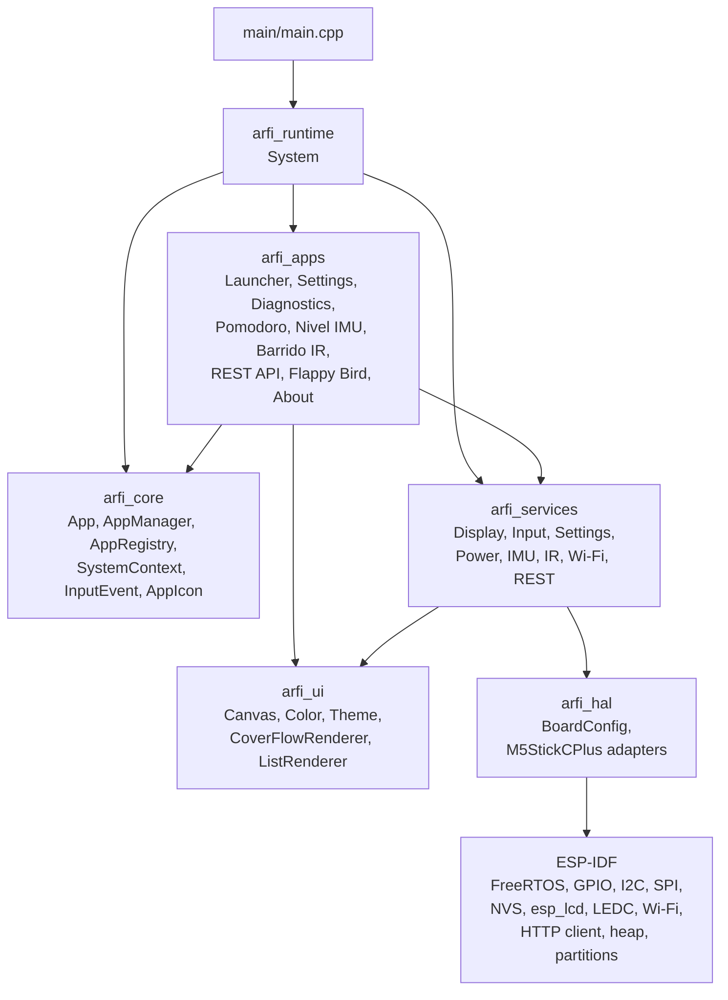

## Component Responsibilities

| Component | Responsibility | Must not do |
|---|---|---|
| `arfi_core` | Central contracts: app interface, registry, manager, normalized input, icons, context | Depend on M5StickC Plus details |
| `arfi_runtime` | Orchestrate boot, services, registered apps, and the main loop | Contain app-specific behavior |
| `arfi_hal` | Low-level board adapters and pin definitions | Expose raw APIs to apps |
| `arfi_services` | Safe shared APIs for hardware and system features | Render full app screens |
| `arfi_ui` | Canvas, colors, theme, launcher renderers | Access GPIO, NVS, or Wi-Fi |
| `arfi_apps` | Foreground user experiences | Initialize hardware directly |
| `main` | Entry point and delegation to `System` | Duplicate initialization logic |

## Main Class Diagram

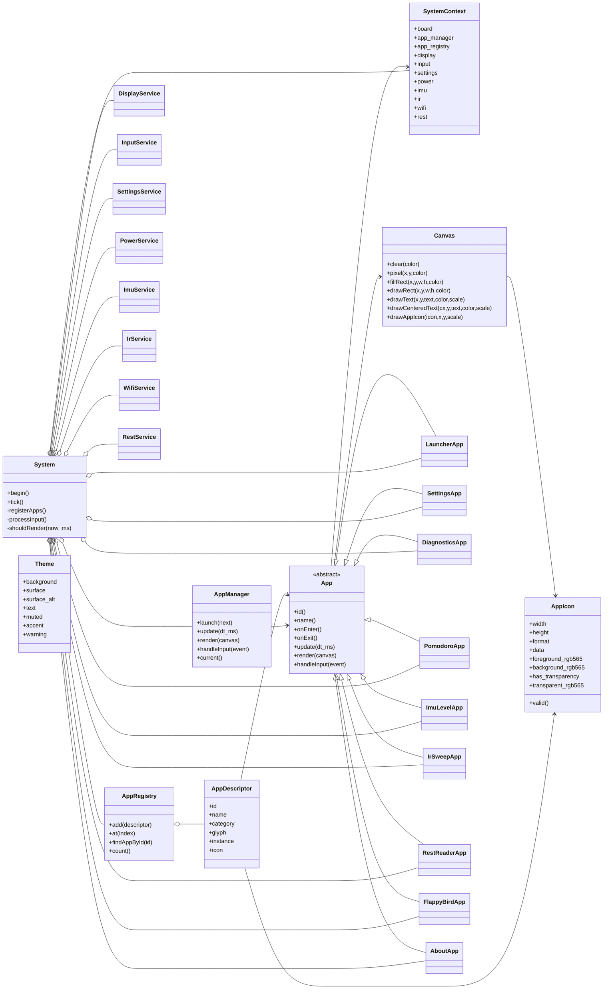

## Services And HAL Class Diagram

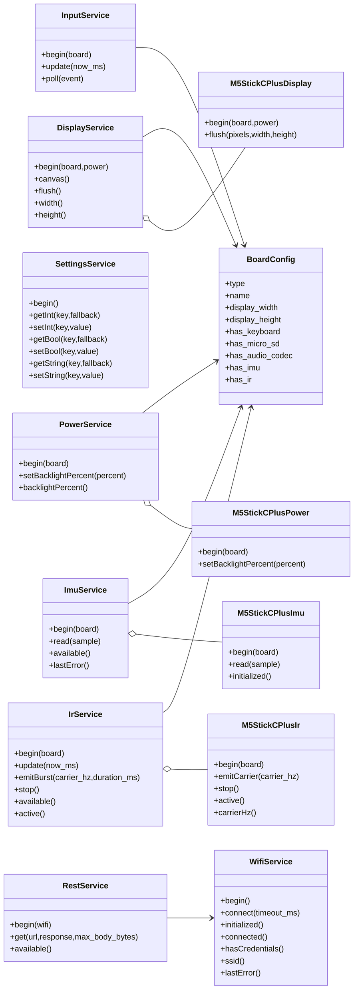

## Boot Sequence

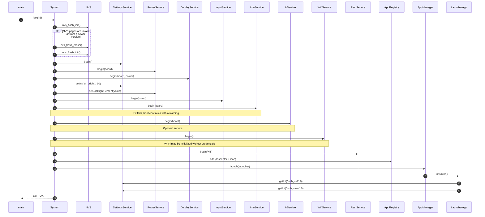

## Main Loop Sequence

`System::tick()` is called continuously by `main`. In v0.1, the app runtime runs on the foreground loop; arfiOS does not create one task per app.

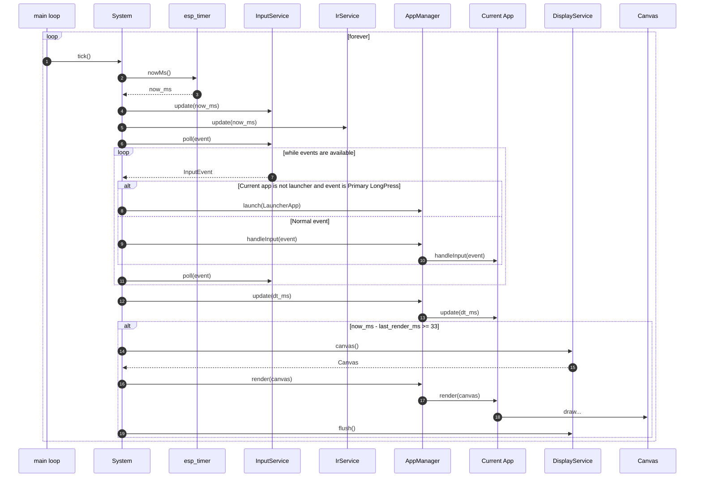

## App Switch Sequence

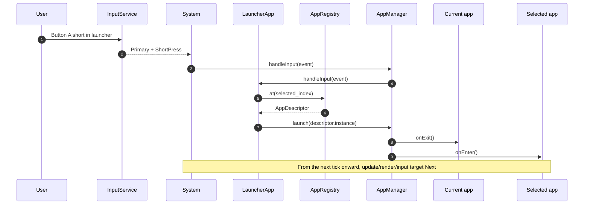

## Global Return To Launcher

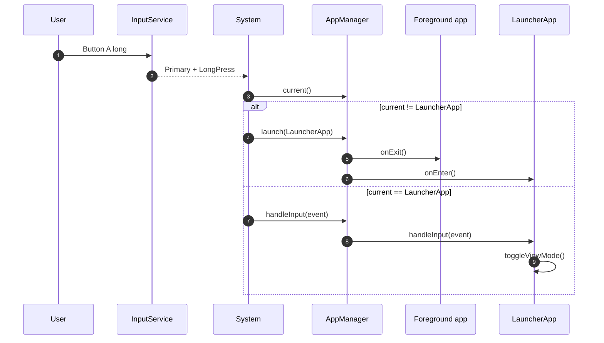

## Launcher Render And Icon Sequence

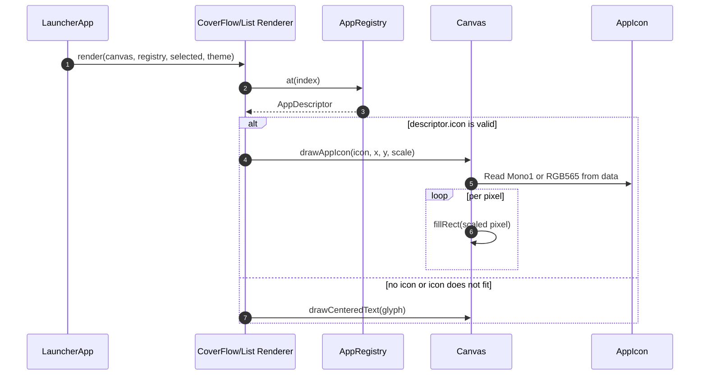

## REST API Sequence

The `REST API` app performs a synchronous HTTP GET and caps the received body. If Wi-Fi is not connected, `RestService` asks `WifiService` to connect before running the HTTP client.

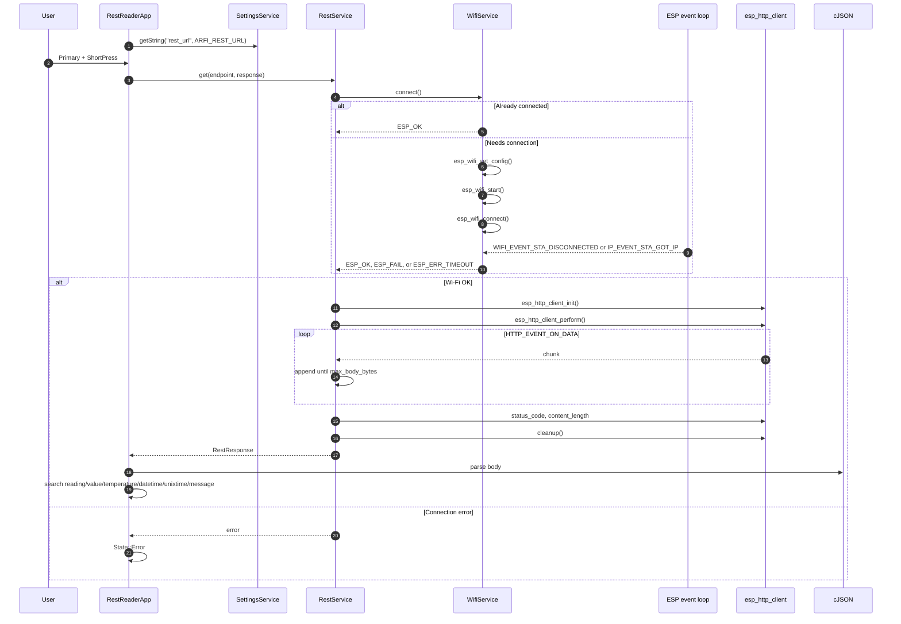

## IMU Sequence

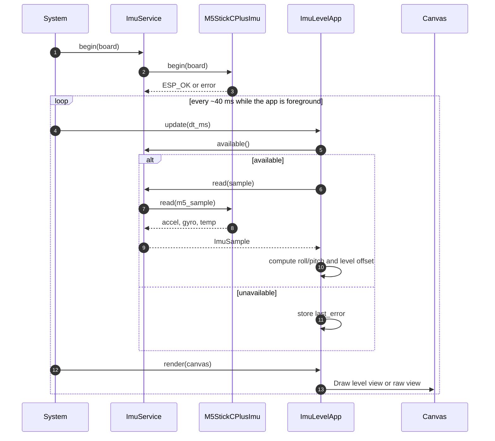

## IR Sweep Sequence

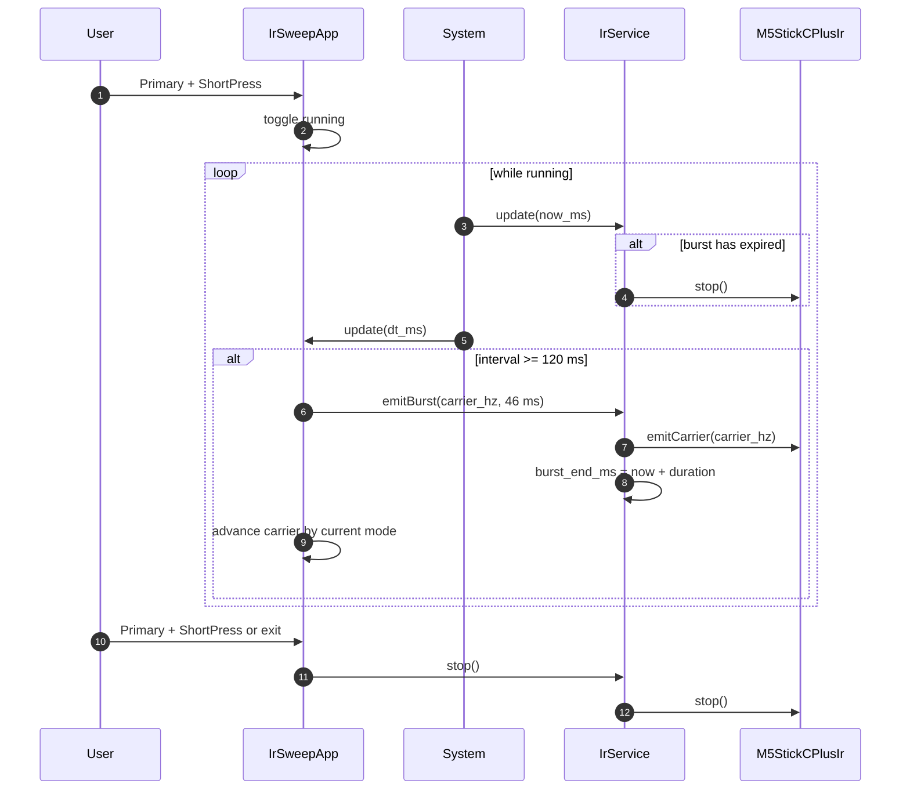

## Settings And Persistence Sequence

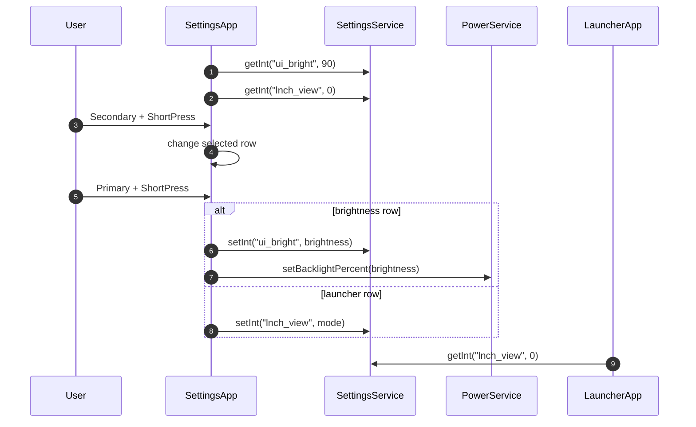

## RAM And Flash Usage

`DiagnosticsApp` shows internal RAM usage/free values through `heap_caps_get_total_size(MALLOC_CAP_INTERNAL)` and `heap_caps_get_free_size(MALLOC_CAP_INTERNAL)`.

`AboutApp` shows RAM and an estimate of app partition flash usage. For flash it reads the ESP32 image header, sums image segments plus padding/checksum/digest, and compares that value against the app partition size.

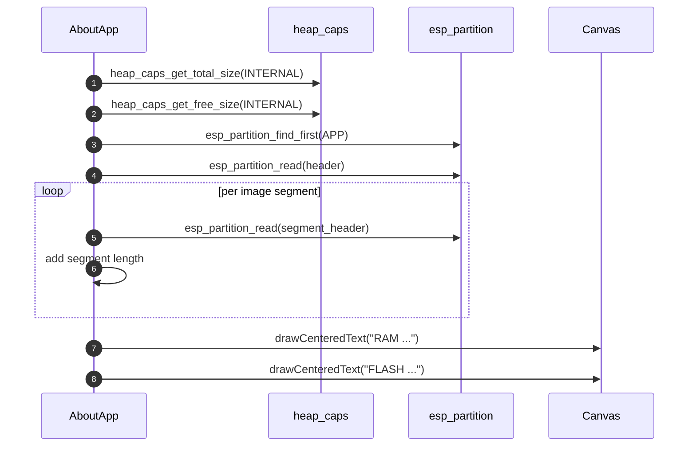

## Included Apps

| App | Category | Services used | Main state | Key controls |
|---|---|---|---|---|
| `LauncherApp` | System | `AppRegistry`, `AppManager`, `SettingsService` | selected app and view mode | B next, B long previous, A launch, A long toggle view |
| `SettingsApp` | System | `SettingsService`, `PowerService` | selected row, brightness, view mode | B row, A change |
| `DiagnosticsApp` | System | ESP-IDF heap | uptime, last input, RAM | buttons test events |
| `PomodoroApp` | Tools | UI | running, remaining seconds | A start/pause, B reset |
| `ImuLevelApp` | Tools | `ImuService` | sample, roll/pitch, zero, raw view | A zero, B raw |
| `IrSweepApp` | Tools | `IrService` | mode, carrier, running | A run/stop, B mode |
| `RestReaderApp` | Tools | `RestService`, `WifiService`, `SettingsService` | idle/fetching/done/error, raw view | A GET, B raw |
| `FlappyBirdApp` | Games | UI | ready/running/game over, pipes, score | A flap/start/retry |
| `AboutApp` | System | heap/partitions, board config | version, RAM, flash | informational |

## Memory Model

- The main framebuffer lives in DMA-capable internal RAM and uses `240 * 135 * 2 = 64,800` bytes.
- App icons are declared as `inline constexpr` with `ARFI_PROGMEM`; in ESP-IDF they live in flash/rodata.
- Apps are members of `System`; they are not dynamically allocated.
- `AppRegistry` stores descriptors by value, up to `kMaxApps = 32`.
- `InputService` uses a fixed 16-event ring buffer.
- `RestService` caps HTTP response bodies to 512 bytes by default.

## Error Handling

Boot distinguishes required services from optional services:

- Required: NVS, settings, power, display, input.
- Optional: IMU, IR, Wi-Fi, REST.

If an optional service fails, the firmware continues and the corresponding app shows `NOT READY` or `ERROR`.

## Architectural Rules

1. Apps do not initialize hardware; they use `SystemContext` and services.
2. Apps should return quickly from `update`, `render`, and `handleInput`.
3. The launcher is a normal app, but `System` gives it special handling for global return on `A long`.
4. Rendering always goes through `Canvas`; apps do not write directly to the display panel.
5. Board pins and panel offsets live in `arfi_hal`.
6. Persistent configuration goes through `SettingsService`.
7. Credentials and REST endpoints are passed through build flags or settings; real values should not be documented.
8. New hardware capabilities should be added in this order: HAL, service, app.

## Path For New Targets

To port arfiOS to another board:

1. Create or extend `BoardConfig`.
2. Add the pin map and concrete HAL adapters.
3. Implement or adapt `DisplayService`, `InputService`, and `PowerService`.
4. Preserve the `Canvas` contract so existing apps stay portable.
5. Add optional services according to capabilities (`has_imu`, `has_ir`, `has_keyboard`, `has_micro_sd`, etc.).
6. Revisit launcher renderers if the canvas is no longer `240x135`.

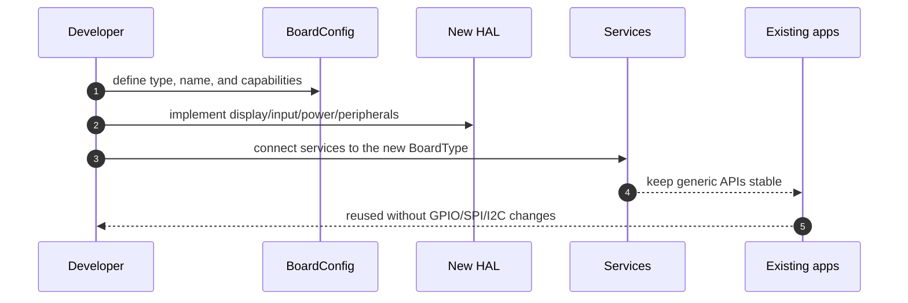
