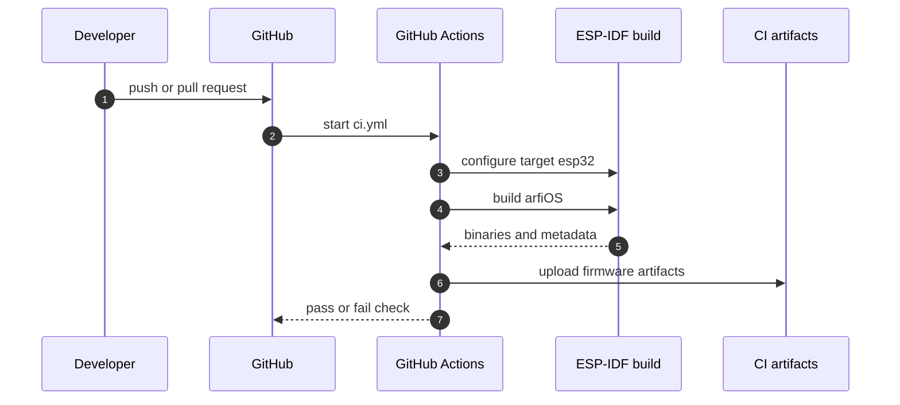
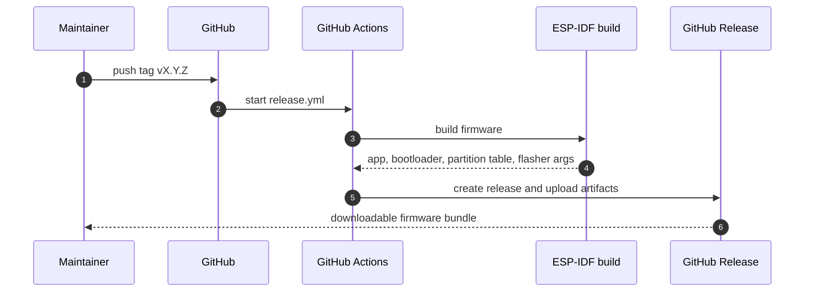

# CI/CD

arfiOS uses GitHub Actions for build validation and tagged releases.

## CI

Workflow: `.github/workflows/ci.yml`

Triggers:

- push to `main` or `master`;
- pull request targeting `main` or `master`.

The CI workflow builds the firmware for:

```text
Target: esp32
Board profile: M5StickC Plus
ESP-IDF: v5.3
```

Artifacts uploaded by CI:

- `build/arfiOS.bin`;
- `build/bootloader/bootloader.bin`;
- `build/partition_table/partition-table.bin`;
- `build/flasher_args.json`;
- `build/project_description.json`.



## Release

Workflow: `.github/workflows/release.yml`

Triggers:

```bash
git tag v0.1.0
git push origin v0.1.0
```

Release artifacts:

- `arfiOS-m5stickcplus-app.bin`;
- `bootloader.bin`;
- `partition-table.bin`;
- `flasher_args.json`.



## Local release build

```bash
idf.py set-target esp32
idf.py build
mkdir -p release
cp build/arfiOS.bin release/arfiOS-m5stickcplus-app.bin
cp build/bootloader/bootloader.bin release/bootloader.bin
cp build/partition_table/partition-table.bin release/partition-table.bin
cp build/flasher_args.json release/flasher_args.json
```
