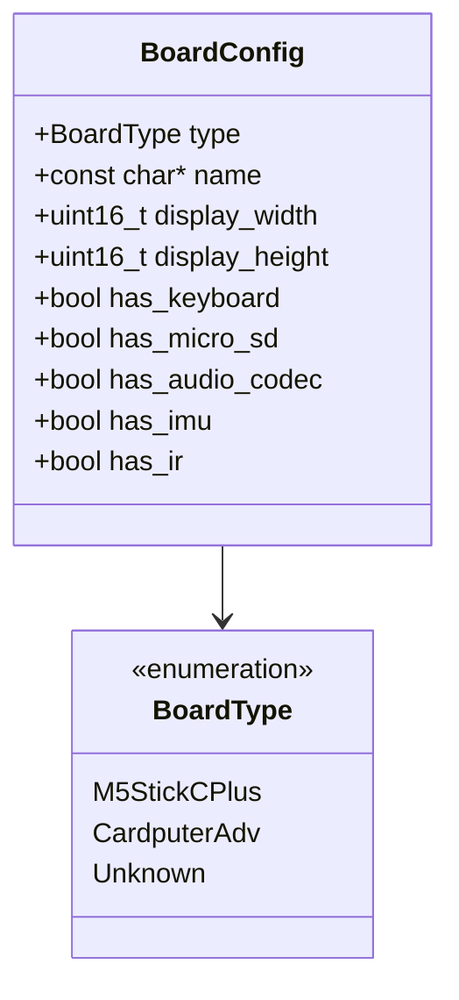
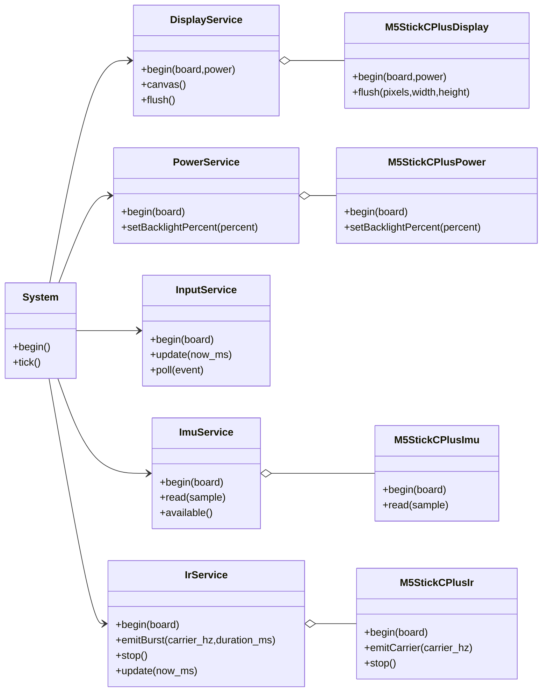
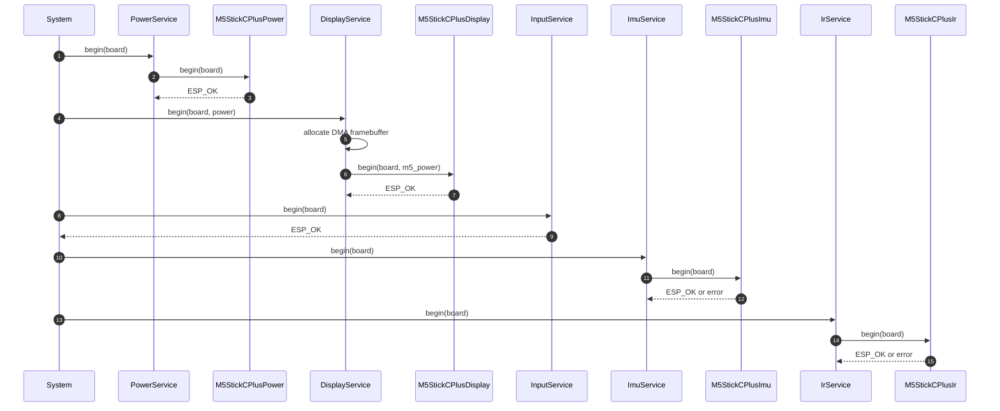
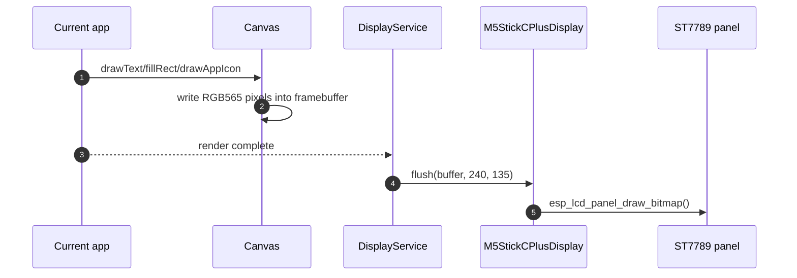
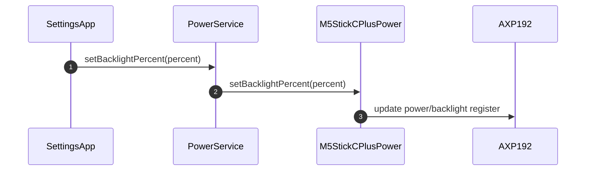
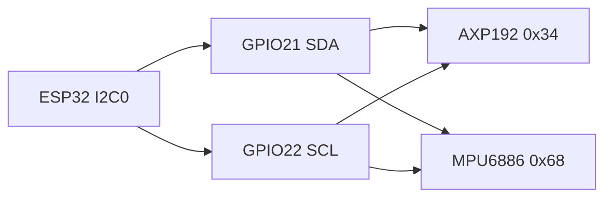
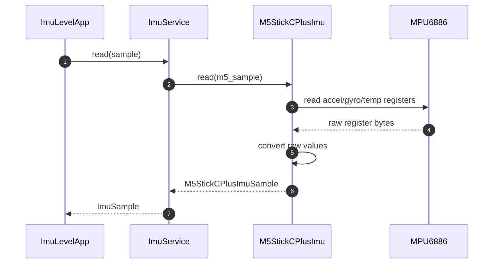
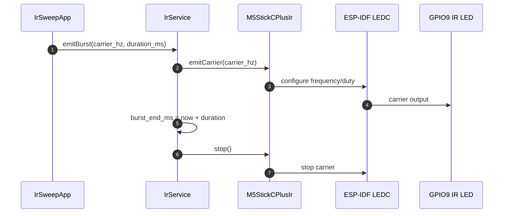
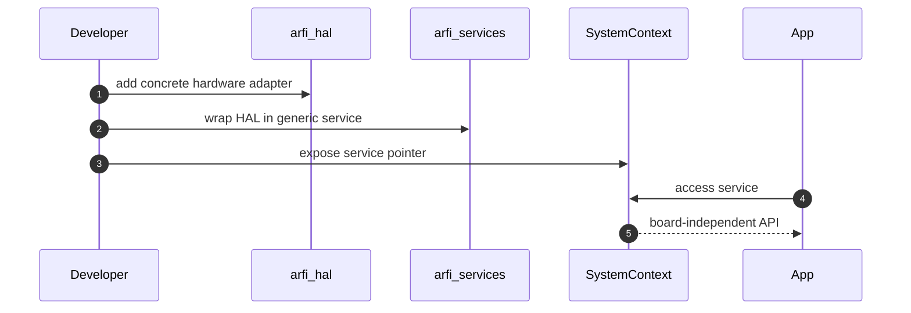

# Hardware Notes

arfiOS v0.1 targets the M5StickC Plus. Hardware-specific details are isolated in `arfi_hal` and surfaced through services, so apps do not depend on raw GPIO, I2C, SPI, LCD, Wi-Fi, or LEDC APIs.

## Target Summary

| Item | Value |
|---|---|
| Board | M5StickC Plus |
| MCU | ESP32-PICO-D4 |
| Display | ST7789v2 TFT |
| Logical canvas | `240x135`, landscape |
| Power management | AXP192 |
| IMU | MPU6886 |
| IR transmitter | onboard IR LED on GPIO9 |
| Build board profile | PlatformIO `m5stick-c` ESP32/4 MB baseline |

## Pin Map

```text
LCD MOSI: GPIO15
LCD SCLK: GPIO13
LCD DC:   GPIO23
LCD RST:  GPIO18
LCD CS:   GPIO5

Button A: GPIO37
Button B: GPIO39
IR LED:   GPIO9

AXP192 SDA: GPIO21
AXP192 SCL: GPIO22
MPU6886 SDA: GPIO21
MPU6886 SCL: GPIO22
```

## Board Configuration

`BoardConfig` describes board capabilities independently from concrete drivers.



For M5StickC Plus:

```text
type = M5StickCPlus
name = "M5StickC Plus"
display_width = 240
display_height = 135
has_keyboard = false
has_micro_sd = false
has_audio_codec = false
has_imu = true
has_ir = true
```

## Hardware Abstraction



## Hardware Boot Sequence



## Display

The display is driven through ESP-IDF `esp_lcd` with the ST7789 panel driver. arfiOS renders into a logical `240x135` framebuffer and then flushes it to the physical panel.

Current ST7789 offsets and orientation:

```text
x_gap = 40
y_gap = 52
swap_xy = true
mirror_x = true
mirror_y = false
```

Some ST7789 batches may require different offsets. If the image is shifted, adjust the constants in:

```text
components/arfi_hal/include/arfi/hal/M5StickCPlusPins.hpp
```

Display render/flush sequence:



## Framebuffer

The framebuffer is allocated in internal DMA-capable memory:

```text
240 * 135 * 2 bytes = 64,800 bytes
```

`Canvas` does clipping in software, so apps can draw near edges without manually clipping every primitive.

## AXP192 Power

The M5StickC Plus uses an AXP192 PMU. arfiOS v0.1 performs a minimal setup:

- initializes the shared I2C bus;
- sets the LDO2/LDO3 voltage register to a safe high value;
- enables display-related power rails;
- enables ADCs for future battery support;
- exposes backlight percentage through `PowerService`.

Battery reading is not implemented in v0.1.

Backlight sequence:



## Shared I2C Bus

AXP192 and MPU6886 share I2C on GPIO21/GPIO22.



## MPU6886 IMU

The M5StickC Plus exposes the MPU6886 on the shared I2C bus. arfiOS initializes it in the HAL and exposes accelerometer, gyroscope, and temperature samples through `ImuService`.

The generic service type is:

```cpp
struct ImuSample {
    float accel_x_g;
    float accel_y_g;
    float accel_z_g;
    float gyro_x_dps;
    float gyro_y_dps;
    float gyro_z_dps;
    float temperature_c;
};
```

Read sequence:



## IR Transmitter

The onboard IR transmitter is driven from GPIO9. arfiOS uses LEDC to generate short carrier bursts between 30 kHz and 60 kHz through `IrService`.

The service caps burst duration to 500 ms and stops the carrier automatically when `IrService::update(now_ms)` sees the burst end time has passed.



## Buttons

Button A and Button B are active-low and mapped by `InputService`:

| Button | GPIO | arfiOS key |
|---|---:|---|
| A | GPIO37 | `Primary` |
| B | GPIO39 | `Secondary` |

See [INPUT_MODEL.md](INPUT_MODEL.md) for debounce, short press, long press, and double press behavior.

## Hardware Extension Rules

When adding a new peripheral:

1. Add board capability fields to `BoardConfig` if needed.
2. Add pins and device constants under `arfi_hal`.
3. Implement a concrete HAL adapter for the board.
4. Add a service that exposes a board-independent API.
5. Inject the service through `SystemContext`.
6. Build apps against the service, not the HAL.


