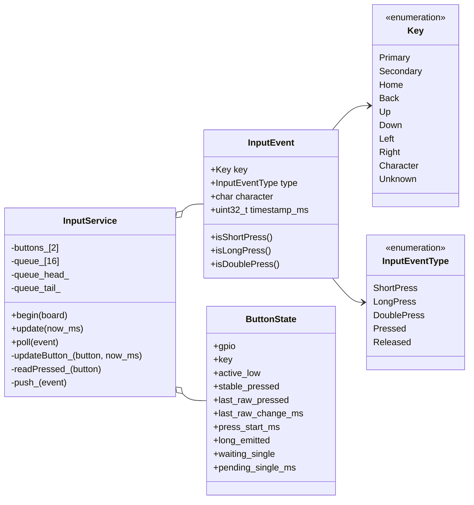
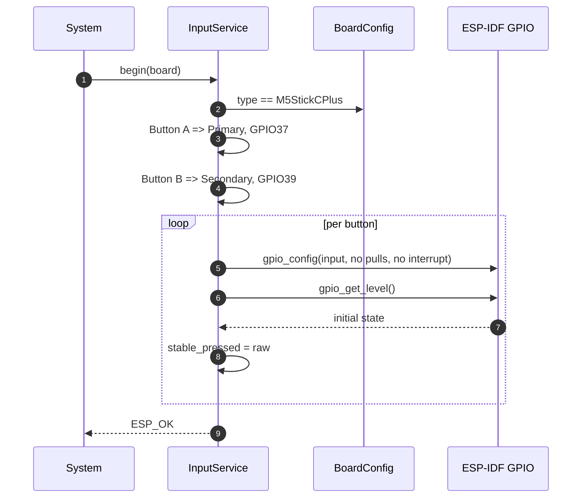
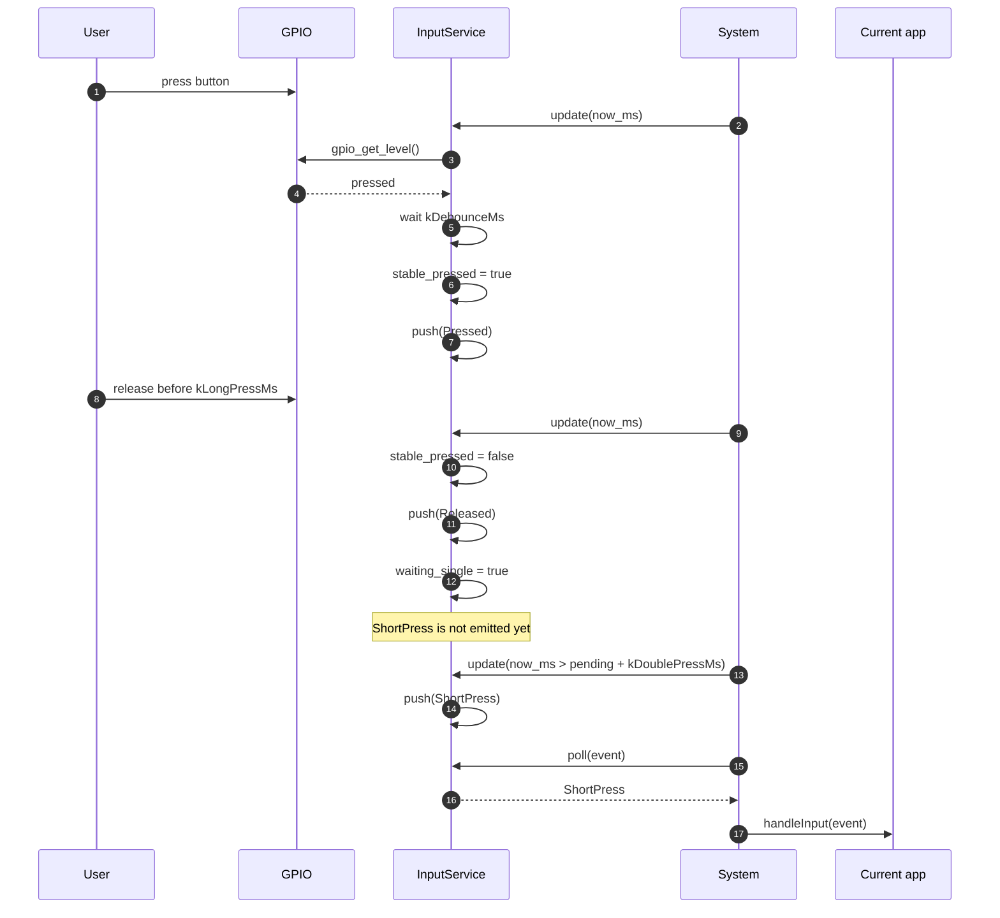
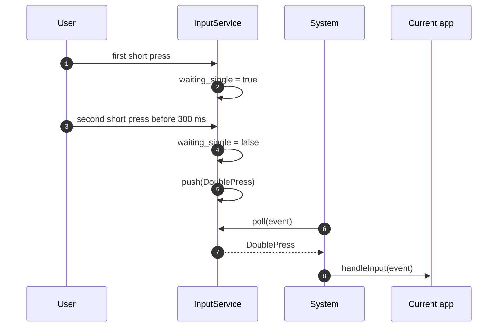
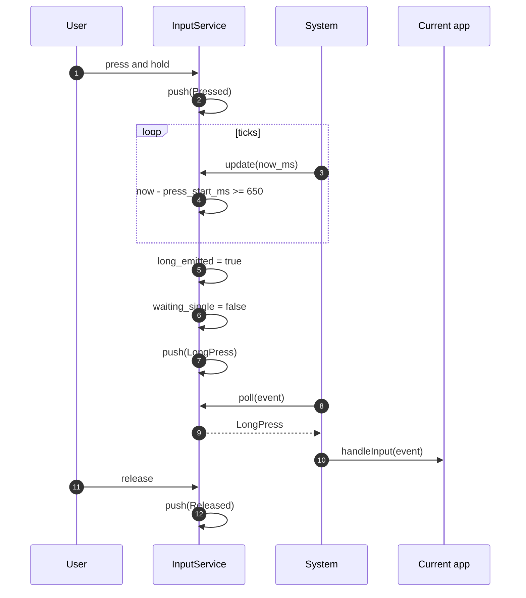
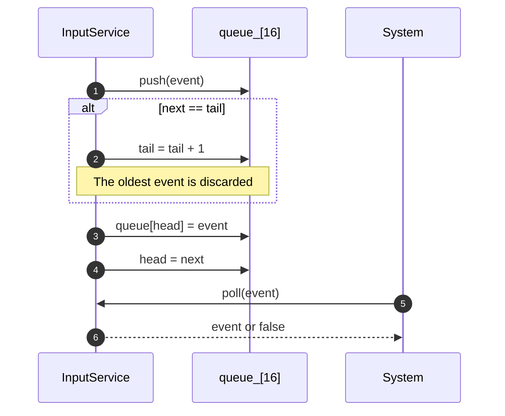
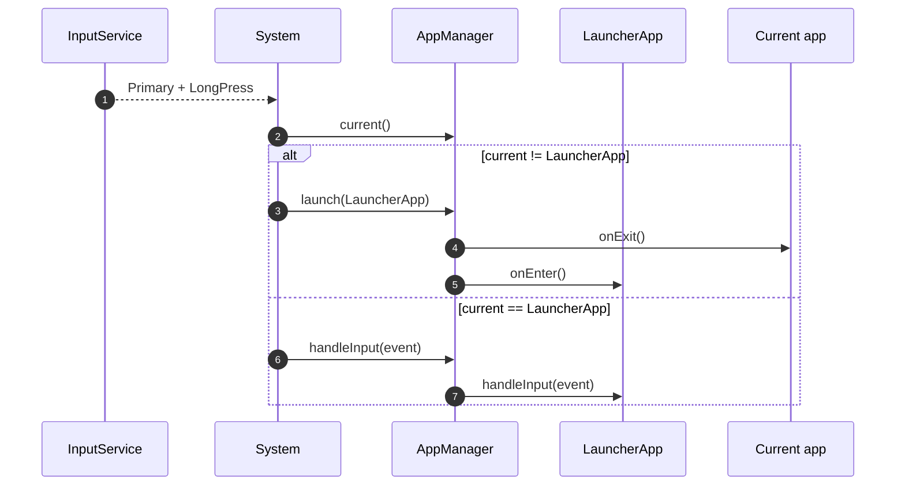
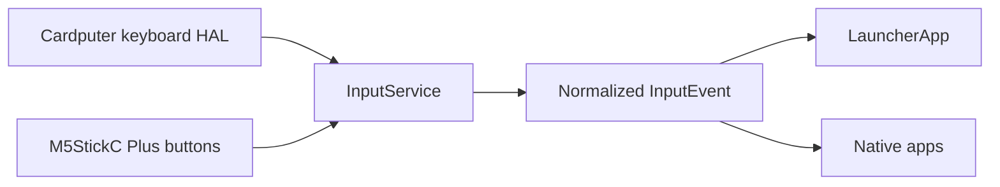

# arfiOS Input Model

arfiOS normalizes physical buttons and future keyboards into common input events. The first target, M5StickC Plus, has only two user buttons, so the firmware uses press semantics: short press, long press, and double press.

## Goals

- Keep apps independent from GPIO37/GPIO39.
- Give inputs semantic names such as `Primary`, `Secondary`, `Home`, `Back`, arrows, and characters.
- Debounce physical button noise.
- Detect `ShortPress`, `LongPress`, `DoublePress`, `Pressed`, and `Released`.
- Provide a global return-to-launcher gesture.

## Core Types

```cpp
enum class Key : uint8_t {
    Primary,
    Secondary,
    Home,
    Back,
    Up,
    Down,
    Left,
    Right,
    Character,
    Unknown,
};

enum class InputEventType : uint8_t {
    ShortPress,
    LongPress,
    DoublePress,
    Pressed,
    Released,
};

struct InputEvent {
    Key key;
    InputEventType type;
    char character;
    uint32_t timestamp_ms;
};
```

## Class Diagram



## M5StickC Plus Mapping

| Physical input | GPIO | Electrical behavior | arfiOS key |
|---|---:|---|---|
| Button A | GPIO37 | active-low | `Primary` |
| Button B | GPIO39 | active-low | `Secondary` |

GPIO37 and GPIO39 are input-only GPIOs. arfiOS does not enable internal pull-ups; it assumes the board provides the required electrical behavior.

## Detection Constants

| Constant | Value | Meaning |
|---|---:|---|
| `kDebounceMs` | 30 ms | minimum stable time before accepting a state change |
| `kLongPressMs` | 650 ms | time before emitting `LongPress` |
| `kDoublePressMs` | 300 ms | window that can convert two short presses into `DoublePress` |
| `kEventQueueSize` | 16 | ring-buffer event queue size |

## Initialization Sequence



## ShortPress Sequence

`ShortPress` is not emitted immediately on release. The service waits for the double-press window. If a second press does not arrive, it emits the short press.



## DoublePress Sequence



## LongPress Sequence

`LongPress` is emitted while the button is still pressed, not when it is released.



## Ring Buffer Sequence

If the queue is full, the oldest event is dropped so input processing keeps moving.



## Launcher Mapping

| Event | Behavior |
|---|---|
| `Secondary + ShortPress` | next app |
| `Secondary + LongPress` | previous app |
| `Secondary + DoublePress` | toggle Cover Flow/List |
| `Primary + ShortPress` | launch selected app |
| `Primary + LongPress` | toggle Cover Flow/List |

## Global Mapping

When the current app is not `LauncherApp`, `System` intercepts:

| Event | Behavior |
|---|---|
| `Primary + LongPress` | return to launcher |



## Future Cardputer-Adv Mapping

The model already includes inputs that do not exist on M5StickC Plus:

| Future input | Proposed key |
|---|---|
| arrow keys | `Left`, `Right`, `Up`, `Down` |
| Enter | `Primary` |
| Esc or Backspace | `Back` |
| dedicated Home key or shortcut | `Home` |
| printable keys | `Character` with `character` set |


