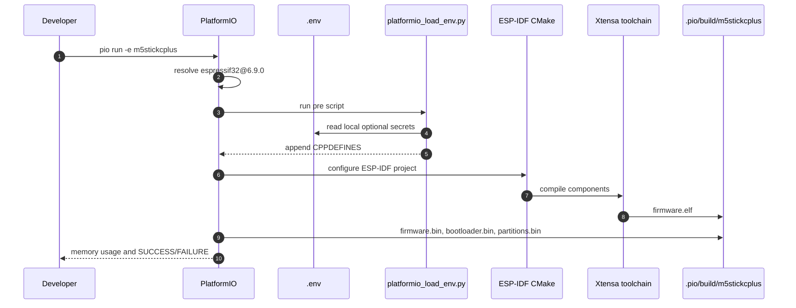
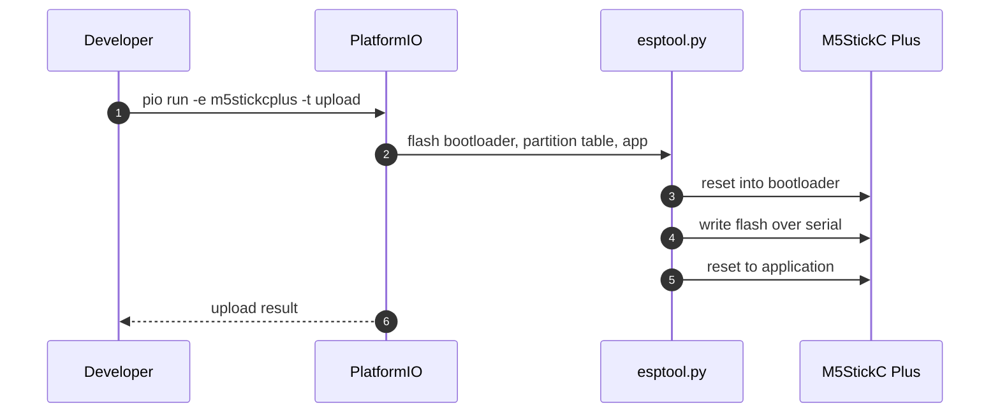
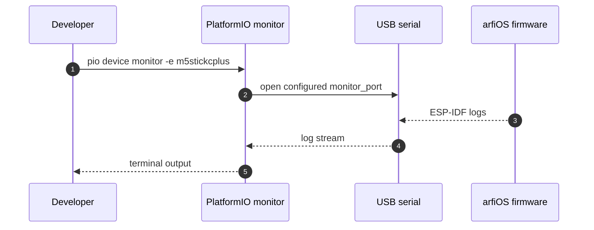
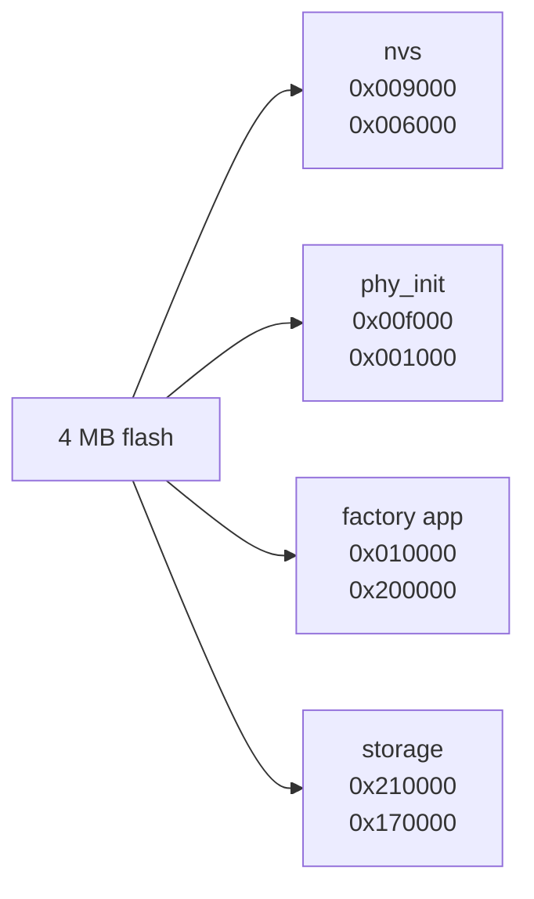

# PlatformIO

arfiOS can be built and flashed with PlatformIO Core through the `m5stickcplus` environment in `platformio.ini`.

## Environment

```ini
[env:m5stickcplus]
platform = espressif32@6.9.0
framework = espidf
board = m5stick-c
```

PlatformIO does not provide a separate M5StickC Plus board profile in the installed Espressif platform package, so the environment uses `m5stick-c`. This is acceptable for arfiOS because the board profile only supplies the ESP32/4 MB flash baseline, while the firmware's own HAL defines the M5StickC Plus display, buttons, PMU, and pin map.

The platform is pinned to `espressif32@6.9.0`, which provides ESP-IDF `5.3.1`. This matches the ESP-IDF 5.3 line used by CI and avoids accidental changes from newer PlatformIO platform releases.

## Build

```bash
pio run -e m5stickcplus
```

The first build downloads the Espressif platform, ESP-IDF framework package, toolchain, and ESP-IDF Python dependencies. Later builds reuse the `.pio/` cache.

## Local Secrets

Wi-Fi credentials and local REST endpoints must not be stored in `platformio.ini`. The public project configuration loads optional local values from `.env` through `scripts/platformio_load_env.py`.

Create `.env` from `.env.example` for local builds:

```dotenv
ARFI_WIFI_SSID=your_ssid
ARFI_WIFI_PASSWORD=your_password
ARFI_REST_URL=http://your-api.local/reading
```

`.env` is ignored by Git. If it is absent, the firmware still builds; Wi-Fi-dependent apps will show that credentials are not configured.



## Upload

With the M5StickC Plus connected as `/dev/ttyUSB0`:

```bash
pio run -e m5stickcplus -t upload
```

The configured upload speed is `1500000`. If a cable or USB adapter is unreliable, lower `upload_speed` in `platformio.ini` to `921600` or `115200`.



## Monitor

```bash
pio device monitor -e m5stickcplus
```

Expected boot logs include:

```text
arfi_main: Starting arfiOS
m5_power: AXP192 initialized
m5_display: ST7789 initialized
input_service: Input service initialized
arfi_system: arfiOS ready
```



## Generated Files

PlatformIO writes build outputs under `.pio/` and generates `sdkconfig.m5stickcplus`. Both are intentionally ignored by Git. Persistent ESP-IDF defaults live in `sdkconfig.defaults`.

## Partition Table

The firmware uses `partitions.csv`:

```text
nvs      0x009000  0x006000
phy_init 0x00f000  0x001000
factory  0x010000  0x200000
storage  0x210000  0x170000
```

The explicit `storage` offset keeps the table unambiguous for both ESP-IDF and PlatformIO.



## Known Notes

ESP-IDF 5.3 logs a deprecation warning for the classic `driver/i2c.h` API used by `M5StickCPlusPower`. The current implementation boots and initializes the AXP192 correctly; migrating to `driver/i2c_master.h` is a future cleanup item.
