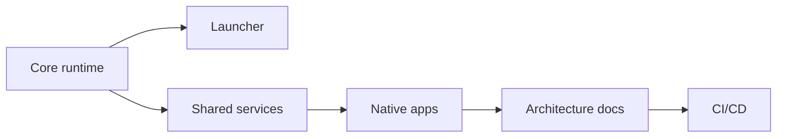
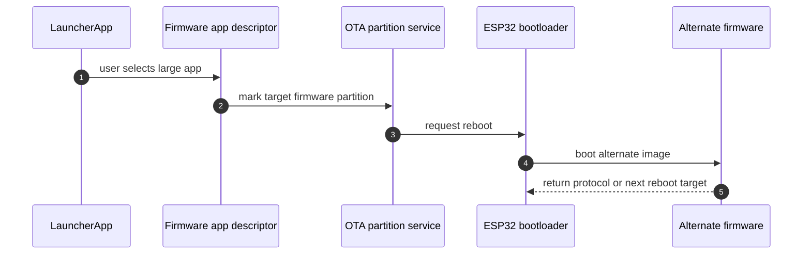

# arfiOS Roadmap

## v0.1 - M5StickC Plus runtime foundation

Implemented:

- ESP-IDF project layout.
- PlatformIO build/upload environment.
- M5StickC Plus board configuration.
- Display service and ST7789 HAL.
- Power service and minimal AXP192 setup.
- Input service with short, long, double, pressed, and released events.
- Settings service backed by NVS.
- App model: `App`, `AppManager`, `AppRegistry`, `SystemContext`.
- Cover Flow launcher.
- List launcher.
- PROGMEM/flash app icons with `Mono1` and `Rgb565` formats.
- IMU service and `Nivel IMU` app.
- IR service and `Barrido IR` app.
- Wi-Fi STA service.
- REST GET service and `REST API` app.
- `Flappy Bird` game.
- `Diagnostics` and `About` resource usage views.
- GitHub Actions build workflow.
- GitHub Actions tagged release workflow.

## v0.2 - Connectivity and utilities

Planned:

- BLE service.
- BLE scanner app.
- iDotMatrix basic controller app.
- Wi-Fi diagnostics app.
- Improved settings editor.
- Runtime editing for REST endpoint and Wi-Fi credentials.
- Better resource diagnostics and storage inspection.

## v0.3 - Cardputer-Adv target

Planned:

- Board selection support.
- Cardputer display HAL.
- Cardputer keyboard input HAL.
- microSD storage service.
- Audio service skeleton.
- App UI adjustments for keyboard navigation.

## v0.4 - Script/config apps

Planned:

- SD manifest reader.
- Script/config app type.
- iDotMatrix macro scripts.
- Theme/icon loading from storage.
- User-installable non-binary app definitions.

## v0.5 - Large app boot entries

Planned:

- OTA partition strategy.
- Firmware app descriptor.
- Reboot into alternate firmware.
- Return-to-launcher protocol.

